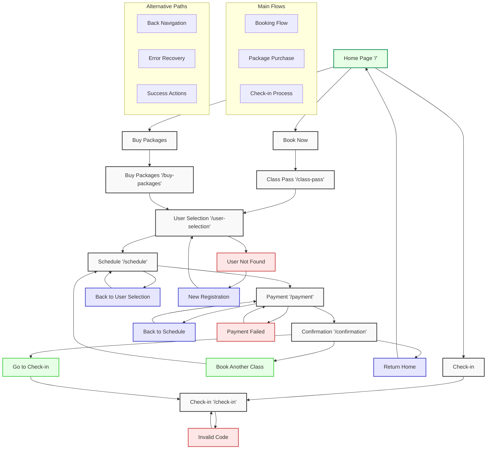

# MatMax Application Flow Diagram

## Flow Description

1. **Home Page ('/')**
   - Main entry point
   - Three primary options: Book Now, Buy Packages, Check-in
   - Modern UI with animated transitions

2. **Book Now Flow**
   - Class Pass → User Selection → Schedule → Payment → Confirmation
   - Allows users to book individual classes
   - Alternative paths:
     - Back navigation between steps
     - Error handling for payment failures
     - User registration for new users

3. **Buy Packages Flow**
   - Buy Packages → User Selection → Payment → Confirmation
   - Purchase class packages and memberships
   - Shares user selection and payment flow with Book Now

4. **Check-in Flow**
   - Direct path to check-in for users with existing reservations
   - Alternative paths:
     - Invalid code handling
     - Direct access from confirmation page

5. **Alternative Paths**
   - Back navigation between any steps
   - Error recovery flows
   - Success action options:
     - Book another class
     - Return to home
     - Go to check-in

## Features

- Bilingual support (English/Spanish)
- Animated transitions between pages
- Responsive design
- Modern UI with Tailwind CSS
- GraphQL integration
- Prisma database
- Error handling and recovery
- Flexible navigation paths
- User session management 